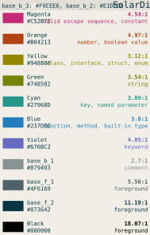

# SolarDim color theme for IDEs

* [What is this](#what-is-this)
* [Showcase](#showcase)
* [__Start using SolarDim__](#start-using-solardim)
* [Detailed showcase](#detailed-showcase)

## What is this

SolarDim is an IDE color theme that aims to strike a balance between typical _light_ and _solarized light_ IDE color themes. It is based around the color `#F0EEE6`: the "Light grayish yellow".

The pure white background of light color themes can be too straining on the eyes, while the colors of solarized light color themes can be too warm, especially if you use a software night screen filter or wear computer glasses. If you found out that you can navigate the code better when using a light theme, but the themes mentioned above are too white or yellow for you, you might want to give SolarDim a try.

## Showcase

Light|SolarDim|Solarized Light
---|---|---
||
||

## Start using SolarDim

* [SolarDim for __VS Code__](https://github.com/RDMCz/SolarDim-VSCode)

* [SolarDim for __JetBrains IDEs__](https://github.com/RDMCz/SolarDim-JetBrains)

* [SolarDim for __Embarcadero Delphi__](https://github.com/RDMCz/SolarDim-Delphi)

## Detailed showcase

